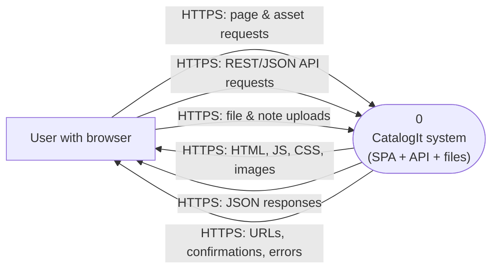

# Data Flow Diagrams (DFD) — Level 0 + Level 1 (Gane–Sarson)

These DFDs provide an overview of the system’s functionality.

## Level 0 (Context diagram)



## Level 1 (Decomposition of process 0)

```mermaid
flowchart TB
  U[User with browser]

  P11(["1.1\nServe SPA & static assets"])
  P12(["1.2\nProcess API requests\n(Rails on EC2)"])
  P13(["1.3\nIssue & validate credentials\n(JWT)"])
  P14(["1.4\nRun background jobs\n(Solid Queue)"])

  D1[("D1\nRDS PostgreSQL\n(users, lists, items, comments, likes, attachments)")]
  D2[("D2\nS3 bucket\n(Active Storage objects)") ]

  U -->|HTTPS: static asset requests\n(/, /assets/*)| P11
  P11 -->|HTTPS: cached HTML/JS/CSS| U

  U -->|HTTPS: API calls\n(/api/*)| P12
  P12 -->|HTTPS: JSON responses| U

  U -->|HTTPS: uploads / downloads\n(/rails/*)| P12
  P12 -->|HTTPS: redirects / signed URLs| U

  P12 <-->|SQL read/write| D1
  P12 <-->|auth checks| P13
  P13 <-->|SQL read user| D1

  P12 <-->|put/get/delete objects| D2

  P12 -->|enqueue jobs| P14
  P14 <-->|job metadata (DB-backed)| D1
```

## Screenshot guidance (if your instructor requires)

If your submission requires screenshots of the DFDs, render the Mermaid diagrams and save images to:

- `docs/final-submission/assets/dfd-level-0.png`
- `docs/final-submission/assets/dfd-level-1.png`

## Notes

- Level 0 does not include data stores; Level 1 introduces stores (PostgreSQL, S3).
- CloudFront can be drawn as an external entity if the instructor expects network components explicitly in the DFD. In that case, split “Serve SPA” into CloudFront→S3 and “Process API” into CloudFront→EC2.

